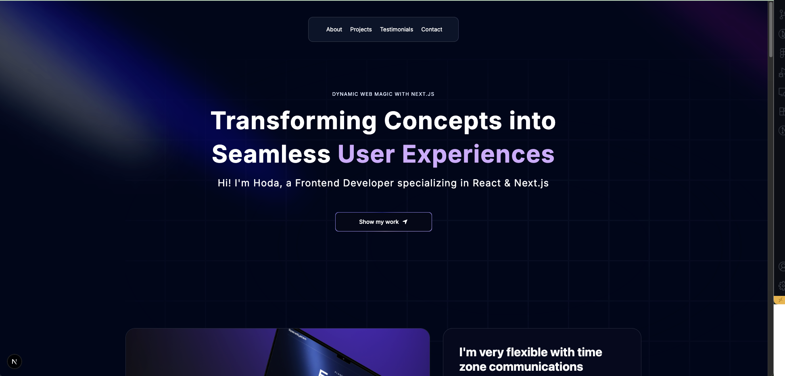
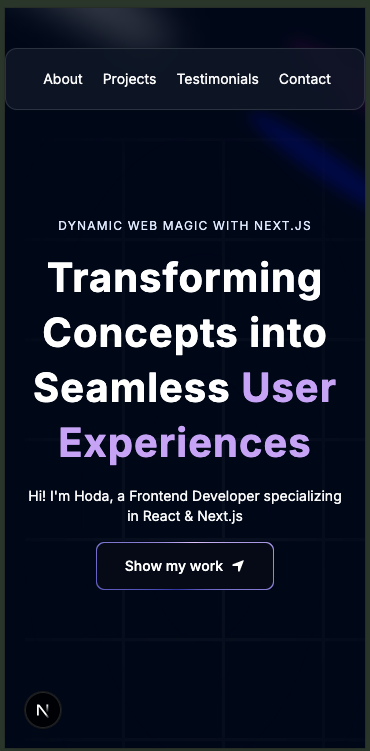

# Personal Portfolio Website

A modern and responsive personal portfolio website to showcase my skills, projects, and approach.  
Built with **Next.js**, **TypeScript**, **Tailwind CSS**, and **Framer Motion**.

---

## Features
- Fully responsive design
- Animated sections (Hero, Projects, Approach, Footer)
- Smooth navigation with FloatingNav
- Modular and reusable components
- Optimized for performance and SEO

---

## Tech Stack
- [Next.js](https://nextjs.org/) – React framework
- [TypeScript](https://www.typescriptlang.org/) – Type safety
- [Tailwind CSS](https://tailwindcss.com/) – Utility-first styling
- [Framer Motion](https://www.framer.com/motion/) – Animations

---

## Live Demo
 [View Portfolio Online](https://your-portfolio.vercel.app)  
*(replace this with your actual deployed link on Vercel)*

---

## Screenshots
| Desktop | Mobile |
|---------|--------|
|  |  |

---

##  Project Structure
├── app
│ └── page.tsx
├── components
│ ├── Hero.tsx
│ ├── Approach.tsx
│ ├── Footer.tsx
│ ├── RecentProjects.tsx
│ ├── Clients.tsx
│ └── ui
│ └── FloatingNav.tsx
├── public
│ └── screenshots

---

##  License
This project is licensed under the MIT License.
